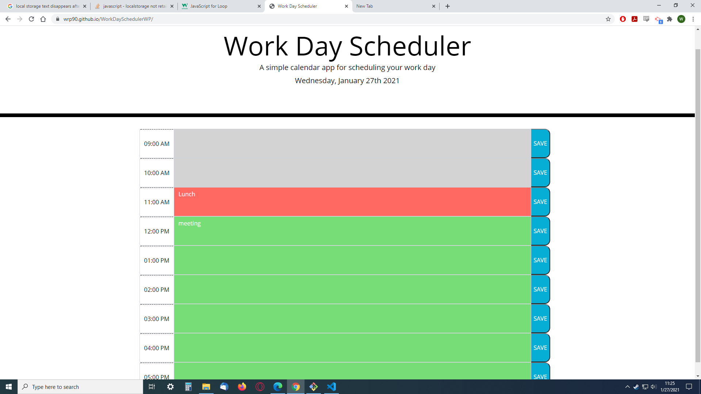

# WorkDaySchedulerWP

# The goal if this project was to create a work day schedule that saves events and is color coded to match past, present and future events. 

# How to use
* The app is very easy to use.  Just click on a text area and type what you want.
* After the save button is pressed, the text will be saved to local storage and will stay even after page is refreshed.
* The text slots are all color coded to show past, present and future times using Moment.js library.

# Screen Shot + Link

* https://wrp90.github.io/WorkDaySchedulerWP/

